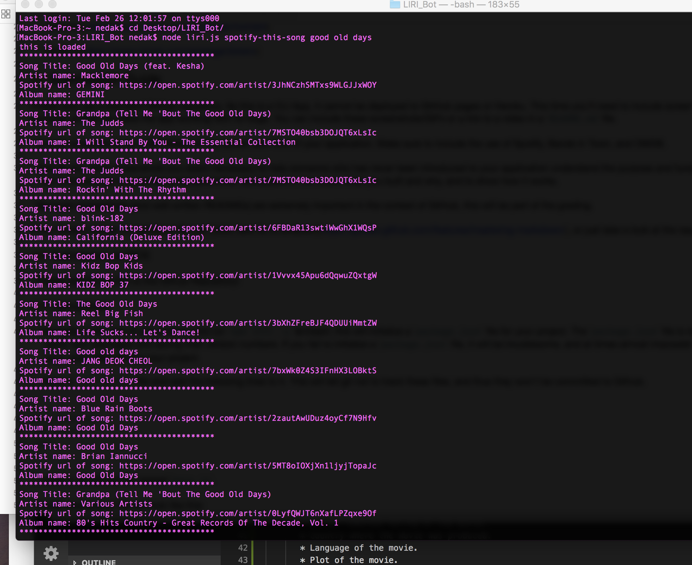
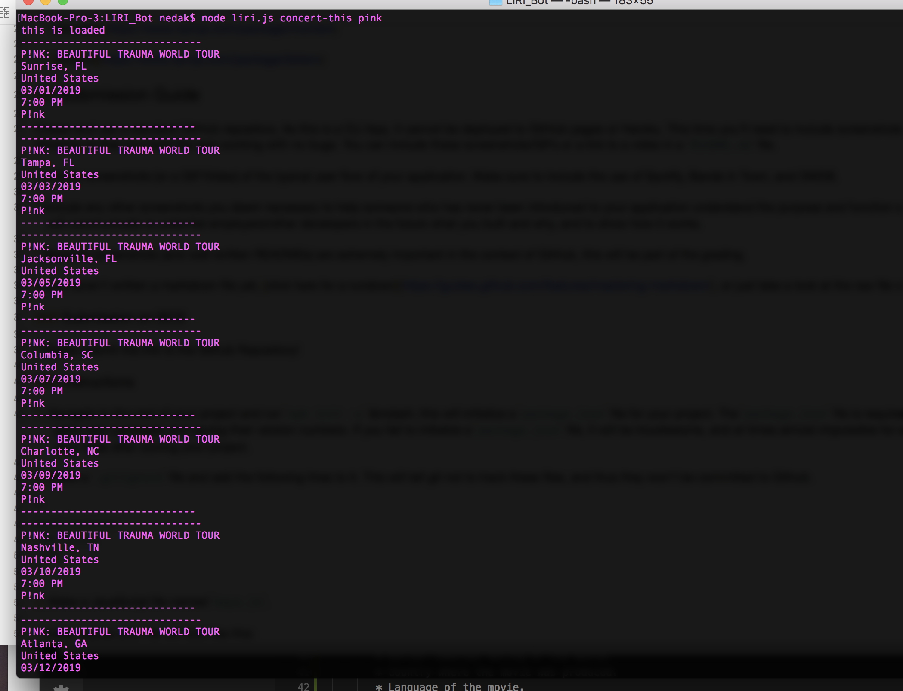
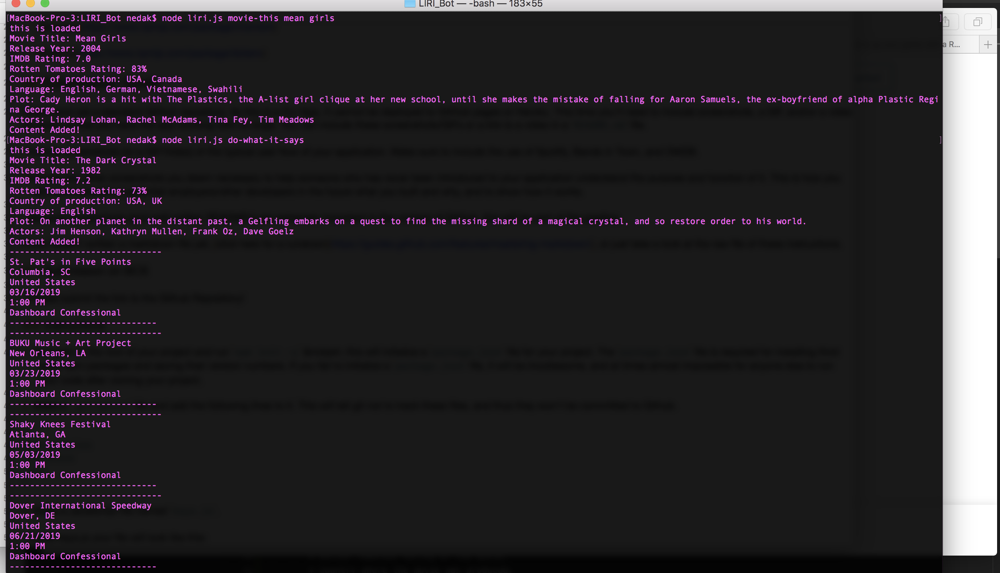
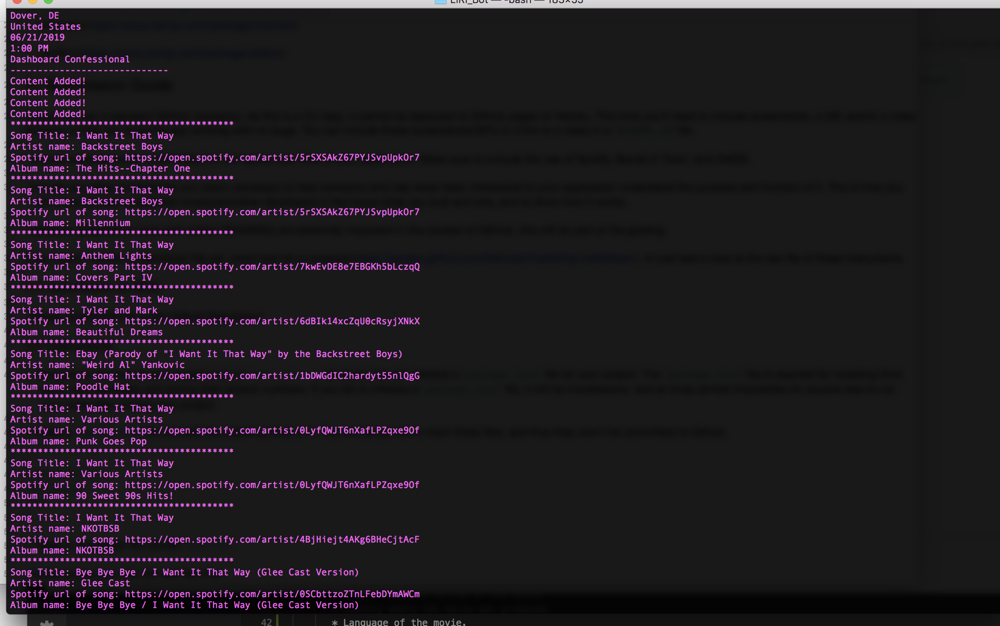

# LIRI_Bot


To see LIRI-Bot in action, check out these screen shots:







1. `node liri.js concert-this <artist/band name here>`

   * This will search the Bands in Town Artist Events API (`"https://rest.bandsintown.com/artists/" + artist + "/events?app_id=codingbootcamp"`) for an artist and render the following information about each event to the terminal:

     * Name of the venue

     * Venue location

     * Date of the Event (use moment to format this as "MM/DD/YYYY")

2. `node liri.js spotify-this-song '<song name here>'`

   * This will show the following information about the song in your terminal/bash window

     * Artist(s)

     * The song's name

     * A preview link of the song from Spotify

     * The album that the song is from

   * If no song is provided then your program will default to "The Sign" by Ace of Base.

  

3. `node liri.js movie-this '<movie name here>'`

   * This will output the following information to your terminal/bash window:

     ```
       * Title of the movie.
       * Year the movie came out.
       * IMDB Rating of the movie.
       * Rotten Tomatoes Rating of the movie.
       * Country where the movie was produced.
       * Language of the movie.
       * Plot of the movie.
       * Actors in the movie.
     ```

   * If the user doesn't type a movie in, the program will output data for the movie 'Mr. Nobody.'


4. `node liri.js do-what-it-says`

   * Using the `fs` Node package, LIRI will take the text inside of random.txt and then use it to call one of LIRI's commands.

     * It should run `spotify-this-song` for "I Want it That Way," as follows the text in `random.txt`.

     * Edit the text in random.txt to test out the feature for movie-this and concert-this.

### BONUS

* In addition to logging the data to your terminal/bash window, output the data to a .txt file called `log.txt`.

* Make sure you append each command you run to the `log.txt` file. 

* Do not overwrite your file each time you run a command.
